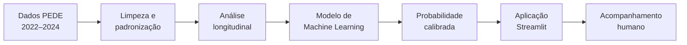

# Datathon Passos Mágicos

## Previsão de risco de defasagem escolar

Projeto de Data Science desenvolvido a partir dos dados educacionais da **Associação Passos Mágicos**, com informações de 2022, 2023 e 2024.

O trabalho combina análise exploratória, acompanhamento longitudinal, Machine Learning e uma aplicação em Streamlit para responder à seguinte pergunta:

> Como utilizar os indicadores educacionais para identificar, com antecedência, estudantes que podem apresentar defasagem no próximo ciclo?

### Acesse o projeto

- [Aplicação no Streamlit](https://techchallenge-fase5-datathon-rtve3hlrtmfjogdva4nyac.streamlit.app/)

---

## Visão geral

A Associação Passos Mágicos acompanha o desenvolvimento de seus estudantes por meio de indicadores acadêmicos, psicossociais, psicopedagógicos e de engajamento. Neste projeto, esses dados foram utilizados em duas frentes complementares:

1. **Compreender a evolução dos estudantes** entre 2022 e 2024;
2. **Estimar a probabilidade de defasagem no ciclo seguinte**, apoiando ações preventivas da equipe.

A solução final não se limita a gerar uma previsão. Ela também valida os dados de entrada, apresenta faixas de prioridade, permite a análise individual ou em lote e mantém a avaliação humana como parte central da decisão.



---

## Principais resultados

O modelo disponibilizado foi treinado para prever se o estudante apresentará defasagem no próximo ciclo. Para simular uma situação real de uso, a avaliação respeitou a ordem do tempo:

- **treinamento:** dados de 2022 para prever 2023;
- **teste temporal:** dados de 2023 para prever 2024.

### Desempenho no teste temporal

| Métrica | Resultado | Interpretação |
|---|---:|---|
| ROC-AUC | **0,8484** | Boa capacidade de separar estudantes com e sem risco |
| PR-AUC | **0,7900** | Bom desempenho para identificar a classe de interesse |
| Recall | **77,60%** | Identificou aproximadamente 8 em cada 10 estudantes que apresentaram defasagem |
| Precisão | **63,56%** | Proporção de alertas prioritários que se confirmaram |
| F1-score | **0,6988** | Equilíbrio entre recall e precisão |
| Brier score | **0,1719** | Erro das probabilidades calibradas; quanto menor, melhor |

Foram utilizados **600 pares de estudantes** de 2022→2023 no treinamento e **765 pares** de 2023→2024 no teste. O threshold operacional foi definido em **49,34%**, utilizando apenas informações do conjunto de treinamento.

> O recall recebeu atenção especial porque, neste contexto, deixar de identificar um estudante que precisa de apoio pode ser mais prejudicial do que gerar um alerta adicional para avaliação da equipe.

### Comparação dos modelos

| Abordagem | ROC-AUC | Recall | Objetivo |
|---|---:|---:|---|
| Modelo completo | **0,8484** | 77,60% | Maximizar a capacidade preditiva |
| Modelo acionável | **0,8084** | 79,22% | Avaliar sinais sem usar diretamente IAN e defasagem atual |
| Baseline de persistência | 0,6765 | 72,73% | Comparação com uma regra simples baseada na situação atual |

O modelo completo apresentou o melhor equilíbrio geral. O modelo acionável mostrou que desempenho, engajamento e contexto também fornecem informações relevantes, mesmo sem utilizar diretamente a defasagem atual.

---

## Indicadores analisados

| Indicador | Dimensão acompanhada |
|---|---|
| **IAN** | Adequação do nível do estudante |
| **IDA** | Desempenho acadêmico |
| **IEG** | Engajamento |
| **IAA** | Autoavaliação |
| **IPS** | Aspectos psicossociais |
| **IPP** | Acompanhamento psicopedagógico |
| **IPV** | Ponto de Virada |
| **INDE** | Índice de Desenvolvimento Educacional |

O notebook apresenta o estudo exploratório, a evolução dos indicadores, as respostas às perguntas do Datathon e a avaliação do modelo.

---

## Definição do problema preditivo

O treinamento permite utilizar duas definições de target.

### `future_defasagem` — modelo utilizado no app

Prevê se o estudante apresentará `Defasagem_N1 <= -1` no ciclo seguinte, incluindo aqueles que já se encontram defasados.

**Pergunta respondida:**

> Qual é a probabilidade de o estudante apresentar defasagem no próximo ciclo?

### `new_defasagem` — análise alternativa

Considera somente estudantes com `Defasagem_N >= 0` e estima o risco de entrada em defasagem no ciclo seguinte.

**Pergunta respondida:**

> Entre os estudantes atualmente adequados, quem apresenta maior risco de entrar em defasagem?

Essa segunda definição reduz a amostra disponível e deve ser avaliada antes de ser adotada em produção.

---

## Perfis do modelo

| Perfil | Informações utilizadas | Finalidade |
|---|---|---|
| `complete` | Inclui IAN e defasagem atual | Obter maior capacidade preditiva |
| `actionable` | Exclui IAN e defasagem atual | Investigar sinais acadêmicos, psicossociais e de engajamento |

O treinamento avalia os dois perfis. O argumento `--model-profile` define qual deles será salvo no artefato utilizado pela aplicação.

---

## Aplicação Streamlit

A aplicação transforma o modelo em uma ferramenta simples de apoio ao acompanhamento dos estudantes.

### Funcionalidades

- predição individual;
- processamento em lote por CSV ou XLSX;
- download de um arquivo modelo com as colunas necessárias;
- validação de campos e faixas permitidas;
- preservação das linhas inválidas, acompanhadas do motivo do erro;
- probabilidade calibrada e faixa de prioridade;
- alertas para valores fora do intervalo observado no treinamento;
- métricas, limitações e importância global das variáveis.

### Campos necessários no processamento em lote

| Campo | Descrição | Faixa aceita |
|---|---|---:|
| `IAA_N` | Indicador de Autoavaliação | 0 a 10 |
| `IEG_N` | Indicador de Engajamento | 0 a 10 |
| `IPS_N` | Indicador Psicossocial | 0 a 10 |
| `IDA_N` | Indicador de Desempenho Acadêmico | 0 a 10 |
| `IAN_N` | Indicador de Adequação de Nível | 0 a 10 |
| `IPV_N` | Indicador de Ponto de Virada | 0 a 10 |
| `Defasagem_N` | Diferença entre a fase atual e a fase esperada | -10 a 10 |
| `Fase_num` | Número da fase atual do estudante | 0 a 10 |
| `IPP_N` | Indicador Psicopedagógico | 0 a 10 |

A coluna `RA` é opcional e pode ser utilizada para identificar o registro no arquivo de saída. Se estiver presente, valores duplicados serão sinalizados.

No resultado do processamento:

- `status_processamento` informa se a linha foi avaliada;
- `motivo_erro` descreve problemas que impediram a previsão;
- `avisos_processamento` registra imputações e valores fora da faixa observada;
- registros válidos recebem a probabilidade estimada e a classificação de prioridade.

---

## Estrutura do repositório

```text
.
├── analise_pede_datathon.ipynb    # análise exploratória e respostas do Datathon
├── app.py                         # aplicação Streamlit
├── model_utils.py                 # validações e transformações compartilhadas
├── train_model.py                 # treinamento e avaliação temporal
├── model_risco_defasagem.pkl      # Pipeline utilizado pelo app
├── model_risco_defasagem.metadata.json
├── requirements.txt               # dependências da aplicação
├── requirements-dev.txt           # dependências de desenvolvimento e testes
├── devcontainer.json              # configuração opcional do ambiente
└── tests/
    ├── test_model_utils.py
    └── test_training_logic.py
```

---

## Como executar o projeto

### 1. Requisitos

- Python 3.11 ou superior;
- Git;
- arquivo da base PEDE 2024 para um novo treinamento.

### 2. Clone o repositório

```bash
git clone https://github.com/mtshto/TechChallenge-Fase5-Datathon.git
cd TechChallenge-Fase5-Datathon
```

### 3. Crie e ative o ambiente virtual

```bash
python -m venv .venv
```

Windows:

```bash
.venv\Scripts\activate
```

Linux ou macOS:

```bash
source .venv/bin/activate
```

### 4. Instale as dependências

Para executar a aplicação:

```bash
pip install -r requirements.txt
```

Para desenvolvimento, notebook e testes:

```bash
pip install -r requirements-dev.txt
```

### 5. Execute o Streamlit

```bash
streamlit run app.py
```

O arquivo `model_risco_defasagem.pkl` e o módulo `model_utils.py` devem permanecer na mesma pasta do `app.py`.

---

## Como treinar novamente o modelo

Modelo completo para prever a presença de defasagem futura:

```bash
python train_model.py \
  --data BASE_DE_DADOS_PEDE_2024_-_DATATHON.xlsx \
  --target-mode future_defasagem \
  --model-profile complete
```

Modelo acionável para prever nova entrada em defasagem:

```bash
python train_model.py \
  --data BASE_DE_DADOS_PEDE_2024_-_DATATHON.xlsx \
  --target-mode new_defasagem \
  --model-profile actionable
```

O treinamento gera:

- `model_risco_defasagem.pkl`: Pipeline treinado com as regras necessárias para a aplicação;
- `model_risco_defasagem.metadata.json`: métricas, configurações, faixas e versões utilizadas.

O threshold é selecionado em uma divisão interna do conjunto de treinamento, de acordo com o recall definido em `--recall-target`. O período de teste não participa dessa escolha.

---

## Testes

Após instalar as dependências de desenvolvimento, execute:

```bash
pytest -q
```

Os testes verificam as principais regras de transformação, validação das entradas e construção da base de modelagem.

---

## Interpretação responsável

As faixas apresentadas no app representam níveis de prioridade para acompanhamento:

- **baixo:** acompanhamento de rotina;
- **monitoramento:** atenção preventiva;
- **prioritário:** avaliação mais próxima pela equipe.

A probabilidade não é uma simples média dos indicadores. Ela representa a frequência estimada do desfecho em padrões históricos semelhantes. Por isso, deve ser interpretada em conjunto com o contexto pedagógico, psicossocial e familiar do estudante.

O gráfico de importância utiliza permutação no teste temporal e representa o comportamento global do modelo. Ele não explica, isoladamente, a previsão de um estudante específico.

> **Importante:** o modelo é uma ferramenta de apoio. Nenhum resultado deve gerar decisões automáticas, punições ou exclusão de oportunidades.

---

## Privacidade, ética e limitações

- utilizar somente dados anonimizados ou pseudonimizados;
- não publicar nomes, CPF ou outros identificadores diretos;
- restringir o acesso aos indicadores psicossociais;
- manter supervisão pedagógica e psicossocial em todas as decisões;
- acompanhar possíveis diferenças de desempenho entre fases e grupos;
- considerar que correlação não representa causalidade;
- revalidar e retreinar o modelo a cada novo ciclo;
- não utilizar a previsão como diagnóstico individual definitivo.

---

## Tecnologias utilizadas

- Python;
- pandas e NumPy;
- scikit-learn;
- Streamlit;
- Matplotlib e Seaborn;
- Jupyter Notebook;
- pytest.

---

## Equipe

- Isabella
- Matheus
- Tiago
- Wesley

Projeto desenvolvido para o **Datathon da Pós-Tech FIAP**, utilizando o case da Associação Passos Mágicos.
